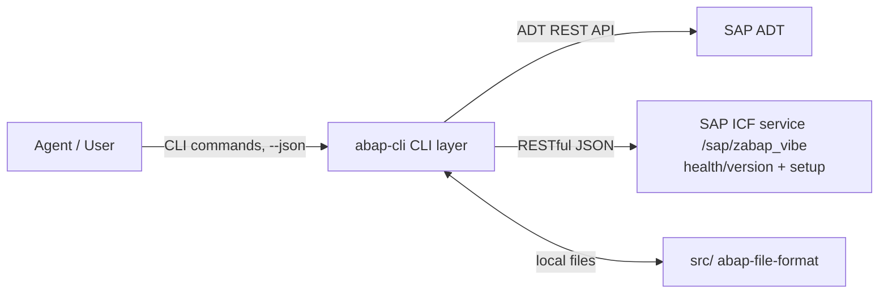

# Architecture

abap-cli follows a three-layer design with clear separation of responsibilities.

## The Three Layers

| Layer | Directory | Language | Responsibility |
|-------|-----------|----------|----------------|
| **CLI** | `src/abap_cli/` | TypeScript | Thin client: HTTP calls to SAP, file I/O, result display |
| **SAP** | `abap/` | ABAP | ICF service handlers (health/version endpoint now; DDIC CRUD next) |
| **Agent** | `skills/` + `agents/` | Markdown | Skill prompts and multi-step workflow orchestration |



## CLI Layer (`src/abap_cli/`)

```
src/abap_cli/
├── index.ts              # commander entry point, registers all commands
├── clients/
│   ├── adt-client.ts     # AdtClientWrapper — thin wrapper over abap-adt-api
│   ├── icf-client.ts     # ICF service client (DDIC, later phase)
│   └── probe.ts          # layer-by-layer connection probe (tls → auth → adt → icf)
├── commands/             # one file per CLI command — thin: parse args, delegate to flows/, print result
├── config/               # .abap.json + user system profiles, keychain (secrets.ts), profile export/import
├── core/                 # shared infrastructure: lazy registration, polyfill, object/transport resolution, limits
├── dictionary/           # DDIC domain logic: ddic-json.ts (abap-file-format JSON ↔ wire mapping)
├── formats/              # abap-file-format file resolution + pull strategies
├── clients/icf-version.ts # ICF service version + deployment check
├── textpool/             # textpool capability probe + mixed-mode route (ADT/ICF)
├── output/               # unified JSON output (CliError/printResult/printError), error/exit codes, help text, check-issue types — see output/README.md
└── flows/                # workflow orchestration, grouped by area
    ├── edit/             # pull / push / create coordinators + per-type modules
    ├── setup/            # init, profile, doctor, command-schemas, deploy helpers
    ├── search/ data/ mime/   # search, SE16N-style data, MIME repository
    └── …                 # config, connection, status/diff/inspect, atc, run, select
```

### Key decisions

- **ADT via `abap-adt-api`** — source objects (Class/Interface/Program/Function Group) use the standard ADT REST API: search, object structure, source GET/PUT, lock/unlock, content-based syntax check, activation, object creation, transport management, usage references (`where-used`).
- **Thin client** — the CLI only orchestrates HTTP calls and file/result handling; business logic stays on the SAP side.
- **Unified output** — every command uses `output/json.ts` (`printResult`/`printError`) so `--json` output is consistent across commands and parseable by agents. `OutputMode` is `'human' | 'json' | 'pretty-json'`; `--json` is compact (token-efficient), `--pretty-json` is indented. `stripEmpty()` recursively trims empty `{}` / `[]` from `data` in JSON modes.
- **Workflow orchestration** lives in `flows/edit/`: one coordinator per command plus per-type modules. `create.ts` (dispatcher) with `create-{ddic,http,tran,ttyp,msag,ddls}.ts`, `create-local.ts`, `create-fugr-func.ts`, `create-schema.ts`; `pull.ts` with `pull-{source,ddic,http,transport,textpool,remote,package,tr,ttyp,msag,ddls,srvd,bdef,cds-extension}.ts`; `push.ts` with `push-object.ts`, `push-fugr.ts`, `push-textpool.ts`, `push-{ttyp,msag,ddls}.ts`; plus `run-flow.ts` (classrun / wrapper static method), `select-flow.ts` (SE16N equivalent), `tcode-flow.ts` (TSTC → TSTCT), `where-used-ops.ts`, `status.ts`, `diff.ts`, `inspect-ops.ts`, `doctor-checks.ts`, `atc.ts`. Shared resolution lives in `core/`: `core/resolve.ts` (object URL + parts resolution, packageName from the search hit), `core/transport.ts` (`resolveTransport`: `--tr` > config > user's open request > error). `push.ts` resolves the transport **per object** (`transportInfo` binding first, `$TMP` free). Commands stay thin: they parse arguments and print the `{ data, human }` result the flow returns.
- **Type routing is data-driven (single source of truth)** — `types/registry.ts` owns the type table (`ObjectTypeEntry`: folder / route / `createObjtype` / AFF schema / `requiresFile` / channel capability). `create` / `pull` / `push` dispatchers consult per-type handler tables instead of `if`-chains:
  - `create` / `pull` use injected handler registries (`registerCreateHandler` / `registerPullHandler` + `createHandlerFor` / `pullHandlerFor`), populated by module-load side effects in the per-type modules. Tests isolate them with `clearHandlersForTesting()` / `restoreHandlersForTesting()`.
  - `push` looks up its ICF routes in the local `ICF_PUSH_HANDLERS` table via `icfPushHandlerFor(objectType)` (DDIC types derived from `DDIC_TYPES`, plus HTTP and TRAN); shared `--check-only` / `--dry-run` guards and the `--atomic` phase-1 validators live in `push.ts` and dispatch through the same table.
  - `create` fail-fast for `--file`-only types and the `create --schema` contract both read `ObjectTypeEntry.requiresFile` (`requiresFileFor` / `typesRequiringFile`).

## SAP Layer (`abap/`)

The bundled ICF service lives under `abap/src/clas/` (the same lowercase-type layout used by the CLI pull destination):
- **`ZCL_ABAP_VIBE_ICF`** — HTTP handler (`IF_HTTP_EXTENSION`) for `/sap/zabap_vibe/`: root path returns a unified JSON envelope with service id + version; unknown paths / methods return unified error JSON.
- **`ZCL_ABAP_VIBE_ICF_SETUP`** — `IF_OO_ADT_CLASSRUN` runner that idempotently creates/binds/activates the SICF node via the standard `CL_ICF_TREE` API (ADR gap: SICF config is not covered by ADT REST).
- **`ZCL_ABAP_VIBE_RUNNER`** — reflection-based wrapper invoked by `abap run --method <name>` to call PUBLIC STATIC methods on arbitrary classes and serialise the `RETURNING` value.
- **`ZCL_ABAP_VIBE_TABL_FORMAT`** — generates abap-file-format three-piece layouts for `TABL` (canonical `tabl.json` + `tabl.ddic` + `tabl.settings.json`); STRU emits the two-piece variant.

Endpoints exposed under `/sap/zabap_vibe/` (current service version `0.5.0`):

| Endpoint | Used by |
|---|---|
| `/` (root, version probe) | `abap deploy status`, `abap init` ICF check |
| `/ddic/<type>` (POST/GET — `DOMA`/`DTEL`/`TABL`/`STRU`) | `abap create` / `abap push` / `abap pull` for DDIC |
| `/http/<name>` (POST/GET — HTTP service) | `abap create HTTP` / `abap push <file>.http.json` / `abap pull --type HTTP` |
| `/textpool/*` (GET read; POST stub) | `abap pull --textpool` (read) on systems without ADT text-elements support. The POST branch unconditionally returns `TEXTPOOL_WRITE_UNSUPPORTED`: textpool write needs the ADT text-elements write endpoint and is unavailable on releases that only expose the non-interactive API (verified on A4H) |
| `/tcode/<code>` (GET) | `abap tcode` (TSTC → TSTCT) |
| `/version-source` (POST) | `abap pull --remote <system>` (TMS RFC destination) |
| `/data/query` (POST) | `abap select --table <name>` (SE16N equivalent, read-only) |

`abap deploy` pushes the bundled sources then triggers the setup class; `abap deploy status` / `abap init` check deployment state/version. JSON generation on the SAP side is unified on `/ui2/cl_json=>serialize` — about 74 handcrafted JSON concatenations across the ICF handler / runner / setup classes were replaced. Development of this layer follows the **Dogfooding** principle — it is itself developed via the CLI's create → pull → edit → push loop.

## Extension Layer

A opt-in extension mechanism lets teams ship internal/downstream capabilities (custom deploy flows, command policies, report-stuck hooks) without modifying core. Two source types, both registered in `.abap.json`:

```jsonc
{
  "extensions": [
    { "sourceType": "npm", "packageName": "@myorg/abap-ext" },   // distributed
    { "sourceType": "path", "path": "./extensions/zlocal.js" }   // in-repo
  ]
}
```

### Lifecycle

- **Lazy load** — `src/abap_cli/index.ts` does NOT `import()` any extension at startup. It sniffs `argv[2]` (matching `extensions list` / `extensions lock` / unknown commands) and uses a commander `preAction` hook to async-load the rest. `abap --help` / `--version` / `doctor` / empty argv never touch extension module top-level code.
- **Hook surface** — `beforeParse` (argv inspection), `beforeCommand` (can **veto** by returning `{block: true, reason}` → `EXTENSION_COMMAND_BLOCKED` / exit 7), and per-command extensions registered as commander subcommands. Built-in commands always win — extensions may NOT override them.
- **Path allowlist** — `sourceType: 'path'` entries must resolve under cwd or `~/.abap-cli/extensions/`. `path_contains_parent_ref` / `path_escapes_allowlist` checked at load.

### Trust hardening (Security)

- **Lockfile pinning** — `extensions.lock.json` records `{packageName, resolved, integrity: 'sha512-<base64>'}` for every npm entry. CLI computes sha512 with `node:crypto` and refuses to `import()` on mismatch.
- **First-run guard** — `abap extensions lock` requires `--allow-unsigned` to create a fresh lockfile, blocking "drop a hostile `.abap.json` and self-pin on first run" attacks.
- **Package-name regex** — `INVALID_PACKAGE_NAME` rejects `..` / `\` / empty scope / URL scheme / absolute paths / non-npm chars before any `createRequire(...).resolve()`.
- **Strict mode** — `ABAP_CLI_EXTENSIONS_STRICT=1` aborts on any `EXTENSION_LOAD_FAILED` (exit 3) with JSON envelope; otherwise warnings are surfaced via `meta.warnings` and the command proceeds.

### Where it lives in code

```
src/abap_cli/
├── extensions/
│   ├── registry.ts          # ExtensionRegistry — owns loaded extensions
│   ├── lockfile.ts          # readLockfile / writeLockfile / regenerateLock
│   ├── lazy.ts              # argv sniff + preAction loader
│   ├── list-command.ts      # `abap extensions list` action body
│   ├── validation.ts        # path allowlist + package-name regex
│   └── spec.ts              # CommandExtension / LifecycleExtension types
└── commands/extensions.ts   # commander registration (list + lock subcommands)
```

See [Agent Integration → Extension Trust](agent-integration.md#extension-trust-027) for the agent-facing contract.

## Agent Layer (`skills/` + `agents/`)

Markdown prompts that orchestrate the CLI for AI agents:

- `skills/` — per-command skill prompts (e.g. `abap-pull`, `abap-push`)
- `agents/` — multi-step workflow prompts

Agents drive everything through CLI commands with `--json`, never through interactive prompts (Constitution Principle I).

## Constitution

The project is governed by a constitution (see `.specify/memory/constitution.md`), key principles:

1. **Agent-First** — everything callable via CLI, `--json` output, no interactive dependency
2. **Three-layer separation** — responsibilities kept clean
3. **abap-file-format** — local files follow SAP conventions
4. **Minimal viable scope first** — start with core object types
5. **SAP-side consistency** — ICF services follow SAP standards, unified JSON responses
6. **Security & credential isolation** — credentials never in version control
7. **Dogfooding** — SAP-side ICF code is developed using the CLI itself
