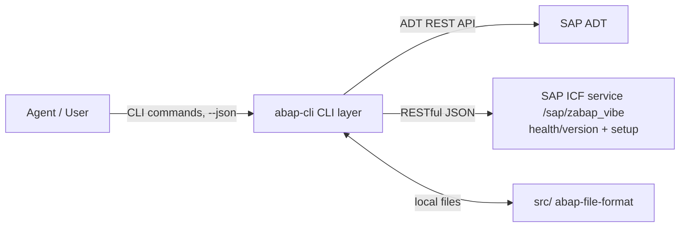

# Architecture

abap-cli follows a three-layer design with clear separation of responsibilities.

## The Three Layers

| Layer | Directory | Language | Responsibility |
|-------|-----------|----------|----------------|
| **CLI** | `src/abap_cli/` | TypeScript | Thin client: HTTP calls to SAP, file I/O, result display |
| **SAP** | `abap/` | ABAP | ICF service handlers (health/version endpoint now; DDIC CRUD next) |
| **Agent** | `skills/` + `agents/` | Markdown | Skill prompts and multi-step workflow orchestration |



## CLI Layer (`src/abap_cli/`)

```
src/abap_cli/
├── index.ts              # commander entry point, registers all commands
├── clients/
│   ├── adt-client.ts     # AdtClientWrapper — thin wrapper over abap-adt-api
│   ├── icf-client.ts     # ICF service client (DDIC, later phase)
│   └── probe.ts          # layer-by-layer connection probe (tls → auth → adt → icf)
├── commands/             # one file per CLI command — thin: parse args, delegate to flows/, print result
├── config/               # .abap.json + user system profiles, keychain (secrets.ts), profile export/import
├── core/                 # shared infrastructure: lazy registration, polyfill, object/transport resolution, limits
├── dictionary/           # DDIC domain logic: ddic-json.ts (abap-file-format JSON ↔ wire mapping)
├── formats/              # abap-file-format file resolution + pull strategies
├── icf/                  # ICF service version constants + deployment check
├── textpool/             # textpool capability probe + mixed-mode route (ADT/ICF)
├── output/               # unified JSON output (CliError/printResult/printError), error/exit codes, help text, check-issue types — see output/README.md
└── flows/                # workflow orchestration: push (object/fugr/textpool), pull, deploy, sync, create, config (params/wizard/write), connection (flow/profile), status/diff, inspect, doctor, atc
```

### Key decisions

- **ADT via `abap-adt-api`** — source objects (Class/Interface/Program/Function Group) use the standard ADT REST API: search, object structure, source GET/PUT, lock/unlock, content-based syntax check, activation, object creation, transport management, usage references (`where-used`).
- **Thin client** — the CLI only orchestrates HTTP calls and file/result handling; business logic stays on the SAP side.
- **Unified output** — every command uses `output/json.ts` (`printResult`/`printError`) so `--json` output is consistent across commands and parseable by agents. `OutputMode` is `'human' | 'json' | 'pretty-json'`; `--json` is compact (token-efficient), `--pretty-json` is indented. `stripEmpty()` recursively trims empty `{}` / `[]` from `data` in JSON modes.
- **Workflow orchestration** lives in `flows/`: `init-flow.ts` (init / `--show-config` / `--unset-*`), `init-agents.ts` (scaffold), `profile-flow.ts` (profile add/set/test/list/show/delete/export/import), `create-flow.ts` + `create-schema.ts` + `create-types.ts` (source + DDIC + HTTP create), `pull-flow.ts` (source / DDIC three-piece / textpool / remote), `push-flow.ts` + `push-object.ts` + `push-fugr.ts` + `push-textpool.ts` (per-object transport resolution; DDIC via ICF), `run-flow.ts` (classrun / wrapper static method), `select-flow.ts` (SE16N equivalent), `tcode-flow.ts` (TSTC → TSTCT), `where-used-ops.ts` (impact assessment), `status.ts` (changed parts), `diff.ts` (per-part compare), `inspect-ops.ts` (`--structure` / `--includes` / `--locks` / `--activation`), `doctor-checks.ts`, `atc.ts`. Shared resolution lives in `core/`: `core/resolve.ts` (object URL + parts resolution, packageName from the search hit), `core/transport.ts` (`resolveTransport`: `--tr` > config > user's open request > error). `push-flow.ts` resolves the transport **per object** (`transportInfo` binding first, `$TMP` free) and routes DDIC `.json` files through the ICF `/ddic/<type>` endpoint. Commands stay thin: they parse arguments and print the `{ data, human }` result the flow returns.

## SAP Layer (`abap/`)

The bundled ICF service lives under `abap/src/clas/` (abapGit layout):
- **`ZCL_ABAP_VIBE_ICF`** — HTTP handler (`IF_HTTP_EXTENSION`) for `/sap/zabap_vibe/`: root path returns a unified JSON envelope with service id + version; unknown paths / methods return unified error JSON.
- **`ZCL_ABAP_VIBE_ICF_SETUP`** — `IF_OO_ADT_CLASSRUN` runner that idempotently creates/binds/activates the SICF node via the standard `CL_ICF_TREE` API (ADR gap: SICF config is not covered by ADT REST).
- **`ZCL_ABAP_VIBE_RUNNER`** — reflection-based wrapper invoked by `abap run --method <name>` to call PUBLIC STATIC methods on arbitrary classes and serialise the `RETURNING` value.
- **`ZCL_ABAP_VIBE_TABL_FORMAT`** — generates abap-file-format three-piece layouts for `TABL` (canonical `tabl.json` + `tabl.ddic` + `tabl.settings.json`); STRU emits the two-piece variant (024).

Endpoints exposed under `/sap/zabap_vibe/` (current service version `0.5.0`):

| Endpoint | Used by |
|---|---|
| `/` (root, version probe) | `abap extension status`, `abap init` ICF check |
| `/ddic/<type>` (POST/GET — `DOMA`/`DTEL`/`TABL`/`STRU`) | `abap create` / `abap push` / `abap pull` for DDIC |
| `/http/<name>` (POST/GET — HTTP service) | `abap create HTTP` / `abap push <file>.http.json` / `abap pull --type HTTP` |
| `/textpool/*` (POST/GET) | `abap pull --textpool` / `abap push <file>.texts/selections/headings.*.properties` on systems without ADT text-elements support |
| `/tcode/<code>` (GET) | `abap tcode` (TSTC → TSTCT) |
| `/version-source` (POST) | `abap pull --remote <system>` (TMS RFC destination) |
| `/data/query` (POST) | `abap select --table <name>` (SE16N equivalent, read-only) |

`abap extension deploy` pushes the bundled sources then triggers the setup class; `abap extension status` / `abap init` check deployment state/version. JSON generation on the SAP side is unified on `/ui2/cl_json=>serialize` (017) — about 74 handcrafted JSON concatenations across the ICF handler / runner / setup classes were replaced. Development of this layer follows the **Dogfooding** principle — it is itself developed via the CLI's create → pull → edit → push loop.

## Agent Layer (`skills/` + `agents/`)

Markdown prompts that orchestrate the CLI for AI agents:

- `skills/` — per-command skill prompts (e.g. `abap-pull`, `abap-push`)
- `agents/` — multi-step workflow prompts

Agents drive everything through CLI commands with `--json`, never through interactive prompts (Constitution Principle I).

## Constitution

The project is governed by a constitution (see `.specify/memory/constitution.md`), key principles:

1. **Agent-First** — everything callable via CLI, `--json` output, no interactive dependency
2. **Three-layer separation** — responsibilities kept clean
3. **abap-file-format** — local files follow SAP conventions
4. **Minimal viable scope first** — start with core object types
5. **SAP-side consistency** — ICF services follow SAP standards, unified JSON responses
6. **Security & credential isolation** — credentials never in version control
7. **Dogfooding** — SAP-side ICF code is developed using the CLI itself
