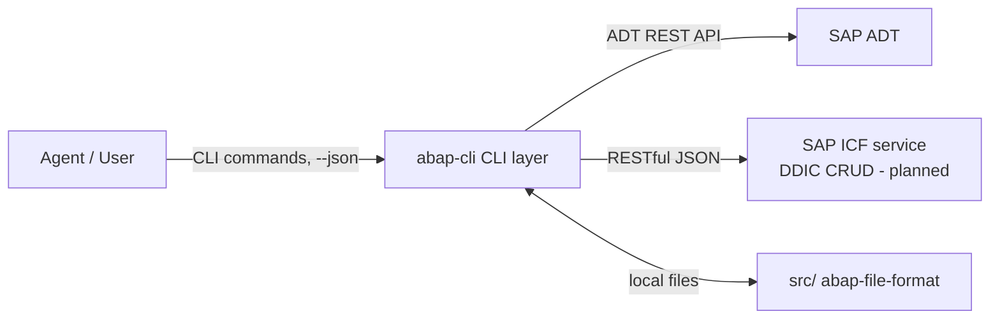

# Architecture

abap-cli follows a three-layer design with clear separation of responsibilities.

## The Three Layers

| Layer | Directory | Language | Responsibility |
|-------|-----------|----------|----------------|
| **CLI** | `src/abap_cli/` | TypeScript | Thin client: HTTP calls to SAP, file I/O, result display |
| **SAP** | `abap/` | ABAP | ICF service handlers for DDIC object CRUD (planned) |
| **Agent** | `skills/` + `agents/` | Markdown | Skill prompts and multi-step workflow orchestration |



## CLI Layer (`src/abap_cli/`)

```
src/abap_cli/
├── index.ts              # commander entry point, registers all commands
├── clients/
│   ├── adt-client.ts     # AdtClientWrapper — thin wrapper over abap-adt-api
│   └── icf-client.ts     # ICF service client (DDIC, later phase)
├── commands/             # one file per CLI command (init, pull, push, ...)
├── config/               # .abap.json + user system profiles
├── crypto/secrets.ts     # OS keychain (keytar) for passwords
├── deploy/deployer.ts    # ICF service deployer
├── formats/              # abap-file-format / DDIC JSON file resolution
├── output/json.ts        # unified JSON output + error shape + exit codes
└── sync/                 # orchestration: object resolution, transport, push flow
```

### Key decisions

- **ADT via `abap-adt-api`** — source objects (Class/Interface/Program/Function Group) use the standard ADT REST API: search, object structure, source GET/PUT, lock/unlock, content-based syntax check, activation, object creation, transport management.
- **Thin client** — the CLI only orchestrates HTTP calls and file/result handling; business logic stays on the SAP side.
- **Unified output** — every command uses `output/json.ts` (`printResult`/`printError`) so `--json` output is consistent across commands and parseable by agents.
- **Sync orchestration** — `sync/resolve.ts` (object URL + parts resolution), `sync/transport.ts` (`resolveTransport`: `--tr` > config > user's open request > error), `sync/push-flow.ts` (lock → write → check/activate → unlock with `finally`-guaranteed release).

## SAP Layer (`abap/`)

Self-built ICF service handlers (RESTful JSON) planned for DDIC object CRUD (Domain, DataElement, Table, Structure, Table Type). The `abap deploy` command deploys the bundled service. Development of this layer follows the **Dogfooding** principle — it is itself developed via the CLI's pull → edit → push loop.

## Agent Layer (`skills/` + `agents/`)

Markdown prompts that orchestrate the CLI for AI agents:

- `skills/` — per-command skill prompts (e.g. `abap-pull`, `abap-push`)
- `agents/` — multi-step workflow prompts

Agents drive everything through CLI commands with `--json`, never through interactive prompts (Constitution Principle I).

## Constitution

The project is governed by a constitution (see `.specify/memory/constitution.md`), key principles:

1. **Agent-First** — everything callable via CLI, `--json` output, no interactive dependency
2. **Three-layer separation** — responsibilities kept clean
3. **abap-file-format** — local files follow SAP conventions
4. **Minimal viable scope first** — start with core object types
5. **SAP-side consistency** — ICF services follow SAP standards, unified JSON responses
6. **Security & credential isolation** — credentials never in version control
7. **Dogfooding** — SAP-side ICF code is developed using the CLI itself
