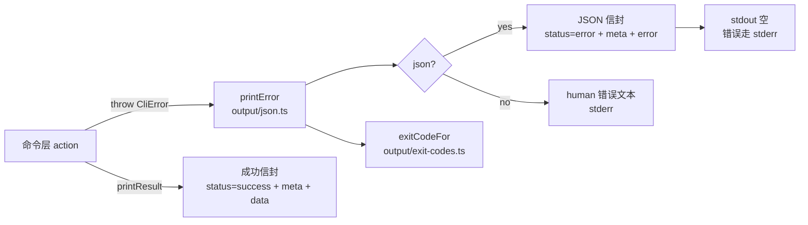

# CLI Output Layer (`src/abap_cli/output/`)

Unified output + error contract. Every command renders through this layer so
`--json` envelopes, exit codes, and human text stay consistent.

## 渲染链路（一个错误从抛出到退出码）

Top-level commander 错误（unknown command / missing arg / unknown option）不经过
`printError`，而是由 [../top-error.ts](../top-error.ts) 的 `handleTopLevelError`
统一处理，再路由到 `renderError`。

## 文件职责

| 文件 | 职责 |
|------|------|
| [error-codes.ts](error-codes.ts) | `ErrorCode` 枚举 + `ErrorCategory` 分类（单一事实来源） |
| [exit-codes.ts](exit-codes.ts) | 分类 → 退出码映射（0–9，稳定契约，改码需扩展合同文档） |
| [json.ts](json.ts) | `OutputMode` / `isJsonMode`、`CliError` 类、`printResult` / `printError` / `renderError`、`printSchema`、`jsonFromCommand`、`CommandSchema` 类型 + `stripEmpty` token-efficient helper |
| [meta.ts](meta.ts) | 普通信封 `meta` 块（command/version/timestamp/durationMs/warnings）与 schema 精简 meta（command/version/durationMs）+ `collectWarning` / `getOriginalArgv` |
| [issues.ts](issues.ts) | `CheckIssue` 输出数据模型（check 命令的 finding，不涉及错误信封） |

## 关键约定

- **`CliError` 是唯一用户可见错误类型**：命令边界（`commands/`、`flows/`、
  `config/`、`formats/`、`clients/`、`core/`、`textpool/`、`dictionary/`、
  `icf/`）抛出的必须构造 `CliError`，由 `test/unit/cli-error-boundary.test.ts` 强制。
- **退出码稳定性**：`EXIT_CODES` 的值跨版本不变；新增分类只能占用保留区间
  （≥10）或走合同扩展。`EXIT_CODES` 的表与分类枚举保持同步。
- **warning ≠ error**：非致命问题（如解锁失败、ICF 探测降级）走
  `meta.warnings`（`collectWarning`），永不出现在错误信封里。
- **stdout/stderr 分离**：`--json` 失败时 stdout 必须为空，信封 + 帮助体走
  stderr（详见 `../top-error.ts` 注释与 `test/unit/output-streams.test.ts`）。
- **三种输出模式**（025-abap-output-merge）：`OutputMode = 'human' | 'json'
  | 'pretty-json'`。`--json` 默认**紧凑**（省 LM agent token），`--pretty-json`
  缩进 2（人看/调试）。`isJsonMode()` 判断是否 JSON 模式，`jsonFromCommand(cmd)`
  统一解析两者（pretty 优先）。
- **Token-efficient `stripEmpty()`**（025）：`renderResult` 的 json 分支递归
  删除 `data` 中的空 `{}` / 空 `[]`（保留 `null`、`false`、`0`、`''`）。Agent
  永远不会消费空集合，可节省 ~5–20% token。human 模式不调用。
- **`buildSchemaMeta()`**（025）：`--schema` 响应使用精简 meta（仅
  `command` / `version` / `durationMs`），不含 `timestamp` 与 `warnings`。
  让 schema introspection 跨运行稳定且最小。
- **`getOriginalArgv()` 懒加载**（025）：取代 module-top 的 `originalArgv`
  常量；首次调用时再读 `process.argv.slice(2)`。
- **变更提示**：改错误码表时同时更新 `error-codes.ts`、`exit-codes.ts`、
  以及 `specs/012-unify-cli-output-contract/contracts/cli-output.md`。
