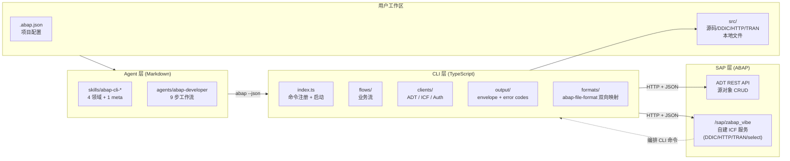
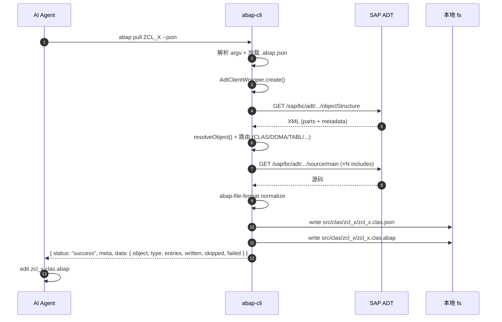
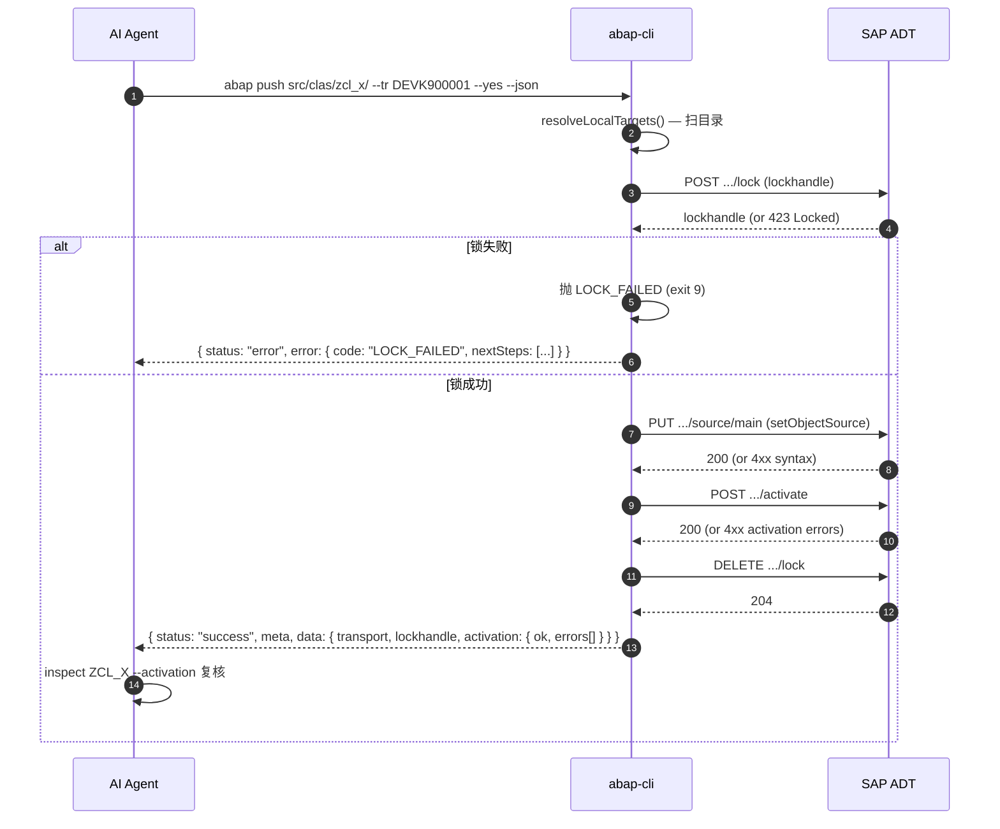
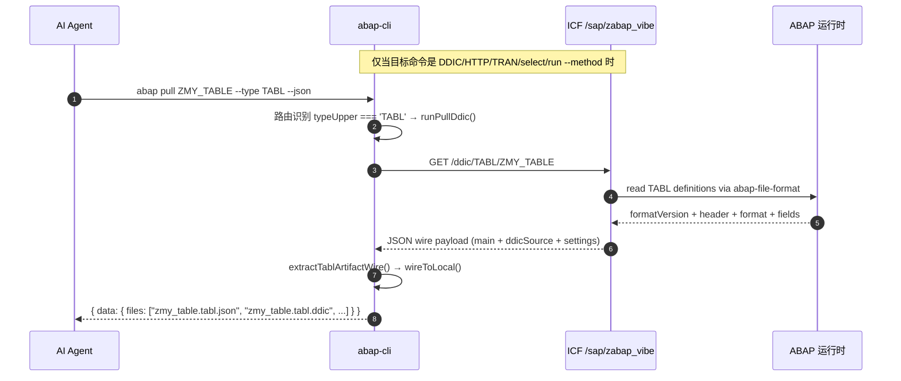
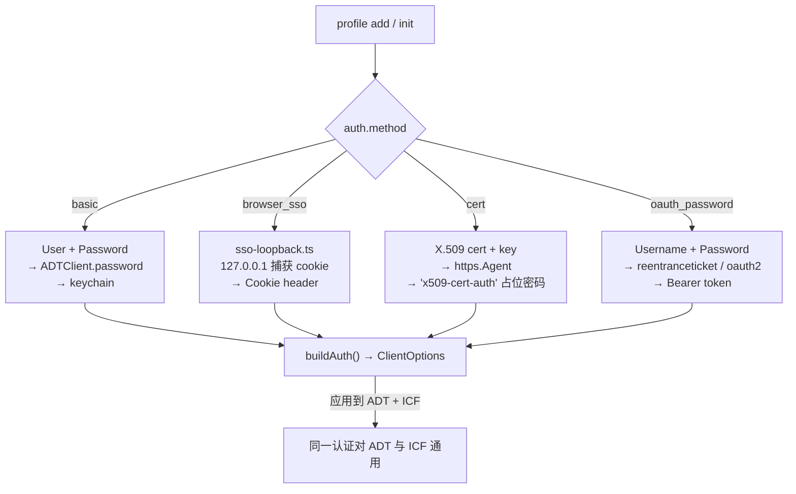
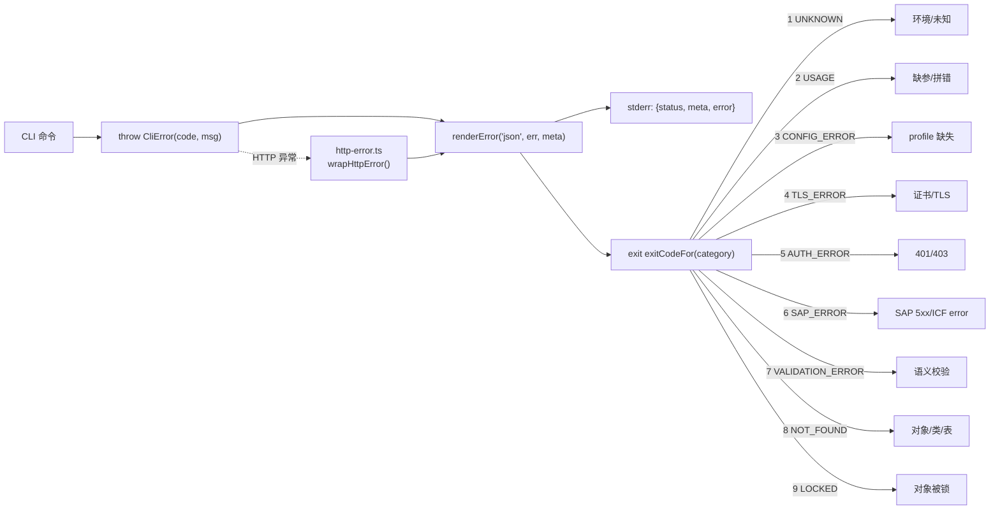
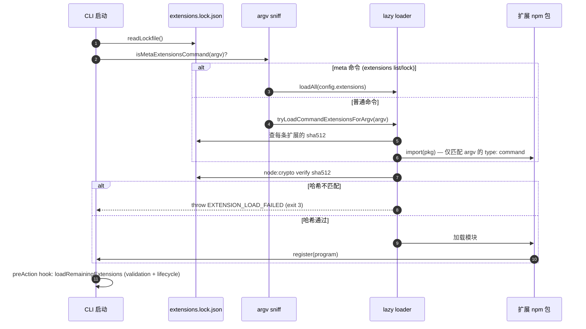
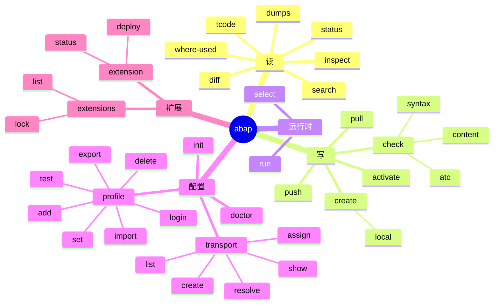

# abap-cli 架构与序列图

## 1. 三层架构图

### 关键边界

| 边界 | 协议 | 方向 |
|---|---|---|
| Agent → CLI | 子进程 + JSON envelope (stdout/stderr) | 双向 |
| CLI → ADT | HTTPS + XML/JSON | CLI → SAP |
| CLI → ICF | HTTPS + JSON | CLI → SAP |
| CLI → 本地文件 | fs/promises | 双向 |

---

## 2. 端到端 `pull` 序列图

---

## 3. 端到端 `push` 序列图（含失败分支）

---

## 4. ICF 自托管服务调用（DDIC / HTTP / TRAN / SELECT）

---

## 5. Auth Strategy 路由

---

## 6. 错误处理与退出码

---

## 7. 扩展加载信任链

---

## 8. 端到端命令全景

---

# references

- 架构文档：[`docs/architecture.md`](../docs/architecture.md)
- 设计决策录：[`wiki/design-decisions/`](design-decisions/)
- 命令文档：[`docs/commands.md`](../docs/commands.md)
- 错误码实现：[`src/abap_cli/output/error-codes.ts`](../src/abap_cli/output/error-codes.ts)
- 退出码实现：[`src/abap_cli/output/exit-codes.ts`](../src/abap_cli/output/exit-codes.ts)
