# abap select

为 Agent 提供 **SE16N 等价**的数据查询能力：在 CLI 端用一条命令完成"看这条记录"，无需打开 SAP GUI 或 SE16N。走 013 自建 ICF 服务的新增 `POST /sap/zabap_vibe/data/query` 端点（服务版本 0.4.0），继承 014 DDIC CRUD 已建立的统一 JSON 信封与认证。

`abap select` 是**严格只读**命令——不获取锁、不触发 transport、不激活、不修改表数据。Agent 可放心地在 push → run → verify 闭环中反复调用：表数据、传输请求、对象激活状态查询前后零变化（spec SC-004）。

> ⚠️ **约束（roadmap P1）**: 014 落地 DDIC **定义** CRUD；016 是数据层首个能力。后续可叠加 `abap export`（快照批量导出）/ `abap impact`（影响分析）等数据相关能力。

## Usage

```bash
abap select --table <name> [--fields <csv>] [--where <clause>] [--limit <n>] [--offset <n>] [--order-by <csv>] [--count-only] [--dry-run] [--json]
abap select --schema [--json]
```

## Options

- `--table <name>`（必填）: 目标 ABAP 表/视图名（regex 由 SAP 端 DDIC 校验；只支持 `TABL` 和 `VIEW`）。
- `--fields <csv>`: 投影字段列表（CSV），每项 regex `^[A-Za-z_][A-Za-z0-9_]*$`；去重。省略 = 全字段（大对象字段 `STRG/RSTR/LCHR/LRAW` 自动排除，列在 `data.excludedFields`；显式投影拒绝为 `INVALID_FIELD`）。
- `--where <clause>`: 过滤子句，`FIELD OP VALUE [AND ...]`，≤ 2000 字符。操作符 `=` `<>` `>` `>=` `<` `<=` `LIKE`。字符串单引号（`''` 转义）、数字裸写、日期 `YYYYMMDD`。**MANDT 过滤拒绝**（隐式会话 client）。v1 仅 `AND` 链（无 OR / 括号 / 函数 / 子查询）。
- `--limit <n>`: 行数上限 `[1, 10000]`，默认 `100`。SAP 端取 `limit+1` 探测截断（`data.truncated`）。
- `--offset <n>`: 行偏移 `[0, 100000]`，默认 `0`。确定性分页需配合 `--order-by`。
- `--order-by <csv>`: 排序 `FIELD:ASC|DESC`（CSV），字段 SAP 端校验、方向 CLI 校验（非法 → `INVALID_ARGUMENT`）。
- `--count-only`: 仅返回匹配行数（`data.count`），不传输行数据；忽略 `--limit`/`--offset`/`--order-by`。
- `--dry-run`: 仅打印计划查询对象（`wouldRun: true`），零 SAP 调用。
- `--schema`: 打印机器可读命令 schema（options / examples / errors）为 JSON 并 exit 0。
- `--json`: 全局 flag——输出 012 统一 JSON 信封；失败时 stdout 严格为空（P1.7）。

## 执行流程与数据流

```mermaid
graph LR
  A[CLI flows/select-flow.ts] -->|buildDataQueryRequest| B[IcfClient.postDataQuery]
  B -->|POST /sap/zabap_vibe/data/query| C[ZCL_ABAP_VIBE_ICF.dispatch_data]
  C --> D[DD02L + DD03L 元数据校验]
  D -->|合法| E[where 语法解析 + 宿主变量绑定]
  E -->|动态 Open SQL limit+1| F[SELECT 行结果]
  F -->|R5 序列化| G[wire envelope]
  G -->|interpret| H[SelectResult JSON 信封]
  H -->|printResult| I[stdout / 012 信封]
```



SAP 端单条 SELECT 由 5 个 helper 完成（research R1–R6）：

1. `read_table_metadata`: DD02L（`TABCLASS` 校验）+ DD03L（字段、长度、小数、键、大对象判定）。
2. `parse_where_clause`: AND 拆分 + field/op/value 扫描 + 类型适配；拒绝 OR/括号/MANDT。
3. `build_row_type`: 由 DD03L 动态构造 `cl_abap_structdescr`，TABL/VIEW 共用同一路径。
4. `execute_select`: `SELECT (fields) FROM (table) WHERE (lt_where) [ORDER BY (lt_ob)] UP TO @lv_limit ROWS OFFSET @lv_offset`，where 值绑定为宿主变量（`@lv_where_v1`, `@lv_where_v2`, …）。行集用 `/ui2/cl_json` 原生序列化（`pretty_name = NONE` 保大写字段名 + 原生类型值），经 partial JSON 嵌入 camelCase 信封（017）。

> ⚠️ **017（0.4.0）原生行值（Q1 B）**: `data.rows` 单元格值遵循 `/ui2/cl_json` 原生类型——NUMC/INT/DEC 为 JSON 数字（前导零丢失，`"0000000001"` → `1`）、DATS 为 `YYYY-MM-DD`、TIMS 为 `HH:MM:SS`、CHAR/CLNT 为字符串；字段名保持大写（与 `data.fields` 一致）。Agent 消费 `--json` 时每个单元格按 `string | number | boolean | null` 处理（CLI `SelectResult.rows` 类型为 `Record<string, unknown>[]`；人类模式自动 `String()`）。

## 输出契约（012 unified）

成功信封：

```jsonc
{
  "status": "success",
  "meta": { "command": "abap select", "version": "0.2.0", "timestamp": "...", "durationMs": 42, "warnings": [] },
  "data": {
    "table": "ZTAB_FIXTURE", "objectType": "TABL",
    "fields": ["MANDT", "ID", "STATUS", "AMOUNT", "NAME", "CREATED"],
    "rows": [ { "MANDT": "001", "ID": 1, "STATUS": "X", "AMOUNT": 1, "NAME": "Item 0000000001", "CREATED": "2026-02-01" } ],
    "rowCount": 50, "truncated": true,
    "excludedFields": ["NOTE"],
    "offset": 0, "limit": 50, "countOnly": false, "dryRun": false, "durationMs": 42
  }
}
```

> 017 起行值为**原生类型**（数字 / `YYYY-MM-DD` 日期 / 字符串），见上方 017 说明。

count-only 信封不含 `rows` / `fields` / `truncated`；dry-run 信封含 `wouldRun: true` 且无 SAP 调用。

人类模式（默认）：ASCII 表格（列宽自适应）+ 行数 + 截断提示 + 排除字段提示 + 耗时。

## 注入安全与只读契约

三层独立防线，全部落在 SAP handler：

1. **字段名白名单**：`--fields` / where / order-by 字段先对照 DD03L 校验并大写归一化；非法即 `INVALID_FIELD` / `INVALID_WHERE`。
2. **值绑定**：where 值经解析后声明为 ABAP 变量（`DATA(lv_where_v1)` 等），嵌入 `WHERE (lt_where)` 时以 `@lv_where_v1` 占位——值永远不进 SQL 文本。
3. **整数边界**：`limit` / `offset` 由 JSON 解析后服务端 `CONV i` + 范围校验（`[1, 10000]` / `[0, 100000]`）；越界 → `LIMIT_EXCEEDED` / `OFFSET_EXCEEDED`。

注入载荷按字面值匹配或空集：

```bash
# ' OR 1=1 -- → INVALID_WHERE（按字面值匹配或空集）
abap select --table ZTAB_FIXTURE --where "STATUS = 'X' OR 1=1 --"

# 含单引号/分号的字符串 → 字面值匹配（无 DROP TABLE 执行）
abap select --table ZTAB_FIXTURE --where "NAME = 'O''Brien; DROP TABLE ZTAB_FIXTURE --'"
```

只读性验证：相同查询执行 10 次后，表数据 / 传输请求 / 对象激活状态与执行前完全一致。

## 错误码（016 新增）

| 错码 | Category / exit | 触发 | 修复建议 |
|------|-----------------|------|----------|
| `TABLE_NOT_FOUND` | NOT_FOUND / 8 | 表/视图不存在 | `abap search <name>` 校对 |
| `TABLE_TYPE_NOT_SUPPORTED` | VALIDATION_ERROR / 7 | 非 TABL/VIEW（pool/cluster/结构/表类型） | `select` 仅支持 TABL+VIEW |
| `INVALID_FIELD` | VALIDATION_ERROR / 7 | 字段不在表中 / 显式大对象投影 | `error.details.validFields` 给合法字段 |
| `INVALID_WHERE` | VALIDATION_ERROR / 7 | where 语法/字段/操作符/类型/MANDT 违规 | `error.details.offset` 指向失败位置 |
| `LIMIT_EXCEEDED` | VALIDATION_ERROR / 7 | limit > 10000 或非整数（SAP 端复检） | `--limit` 在 `[1, 10000]` |
| `OFFSET_EXCEEDED` | VALIDATION_ERROR / 7 | offset > 100000 或非整数 | `--offset` 在 `[0, 100000]` |
| `QUERY_FAILED` | SAP_ERROR / 6 | 动态 SQL 运行时异常 | `abap activate <table>`；检查表存在 |

## v1 边界（roadmap 后续）

- 仅 TABL + VIEW（pool/cluster/结构/表类型/CDS 视图延后到 P2）。
- where 仅 `AND` 链（OR/括号/函数/子查询延后）。
- 无 `--client` 覆盖（客户端依赖表隐式限定会话 client）。
- 大对象字段排除不截断；显式投影拒绝。
- v1 不做 `AUTHORITY-CHECK`（如 `S_TABU_DIS`）——文档化限制；连接用户授权即信任边界。
- 不支持 LIKE `ESCAPE` 子句（pattern 中 `%` `_` 是通配字面值无法转义）。
- CDS 视图与 HANA 视图延后到 P2。

## 版本与服务依赖

- **CLI 版本**: 0.2.0（含 `select` 命令）。
- **ICF 服务版本**: **0.4.0**（`abap extension deploy` 部署后可用）。`abap doctor` / `abap init` 探测 outdated 时升级。
- **握手**: 复用 014 DDIC CRUD 的 `ZCL_ABAP_VIBE_ICF` 类（`/data/*` 子路由新增）。
- **开发模式**: 014 `ICF_SERVICE_VERSION` + ABAP `gc_version` 同步 bump 0.3.0 → 0.4.0（017：select 行值原生类型化）。

## 错误修复速查

```text
TABLE_NOT_FOUND           table does not exist           →  abap search <name> / abap pull <name>
TABLE_TYPE_NOT_SUPPORTED  pool/cluster not queryable      →  use abap pull instead
INVALID_FIELD             field not in table              →  pick from error.details.validFields
INVALID_WHERE             bad where grammar               →  FIELD OP VALUE joined by AND
LIMIT_EXCEEDED            --limit > 10000                 →  --limit in [1, 10000]
OFFSET_EXCEEDED           --offset > 100000               →  --offset in [0, 100000]
QUERY_FAILED              runtime SQL failure             →  abap activate <table>
```

## 关联命令与流程

- **014 `abap create TABL`**: 建表 → `abap select` 看数据 = 完整闭环。
- **015 `abap run`**: 跑 classrun/静态方法（含 INSERT 数据） → `abap select` 看数据 = 验证闭环。
- **`abap extension deploy`**: 部署 `ZCL_ABAP_VIBE_ICF`（含 `/data/query` 端点）。
- **`abap search`**: 在 `TABLE_NOT_FOUND` 时定位对象名。

## 引用

- spec: `specs/016-abap-select/spec.md`
- plan: `specs/016-abap-select/plan.md`
- research（动态 SQL 注入安全 + DDIC 元数据 + 行类型构建）: `specs/016-abap-select/research.md`
- data-model（实体 + 错误映射）: `specs/016-abap-select/data-model.md`
- contracts（HTTP / CLI 契约）: `specs/016-abap-select/contracts/`
- quickstart（mock + 真实 SAP 验证场景）: `specs/016-abap-select/quickstart.md`
- tasks（54 个任务）: `specs/016-abap-select/tasks.md`